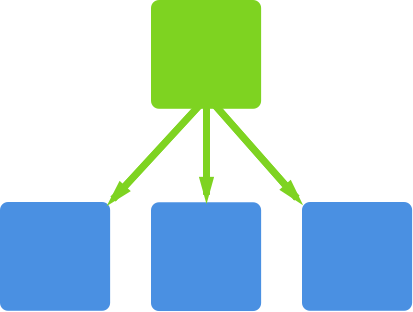

slidenumbers: true
footer: @tgvashworth

# [fit] Frontend Archaeology

### [fit] Digging through TweetDeck for lessons at scale

^ The theme is the future of frontend

^ Let's look dig through an old codebase

---

**Tom Ashworth**
@tgvashworth
*Tech Lead, TweetDeck*


^ Name. Find me on Twitter.

^ Job. Role.

^ Neon Saints.

---


---


^ So if you don't know TweetDeck, let me show you...

---

# TweetDeck

A few million users.
Six billion API requests every day.
Maybe eighty thousand lines of JavaScript.
Six years of git log.

^ Here's a few facts and figures about TweetDeck.

^ Give you an understanding of where I'm coming from and the kinds of problems I work on.

---

# Topics

Architecture & refactoring
Complexity & communication
Operations

^ I have broadly three topics to talk about today.

^ First, architecture, structure, programming styles and refactoring.

^ Secondly — complexity, technical debt, and how to manage it through systematic changes to the way you communicate as a team.

^ Thirdly, the increasing role of operations in frontend development.

---

> As frontend technology matures,<br>so must our practice.

^ One important message.

^ The future of frontend is larger and more complex codebases.

---

# Architecture & refactoring

---

# Flight.js

Event-driven JavaScript framework
Used on TweetDeck & Twitter.com
As a company, we're moving to React

^ To start with, I want to introduce you our JavaScript framework

---

```js
const Example = component(example, withExtras);
function example() {
  this.after("initialize", function () {
    this.on("click", this.onClick);
  });

  this.onClick = function (event) {
    this.trigger("exampleWasClicked", {
      some: "data"
    });
  };
}
```

^ PAUSE

---

*"Attaching"* a component to the DOM:

```js
Example.attachTo("#example", {
  config: "data"
});
```

---

Using *"advice"*:

```js
this.onClick = function () { ... };
this.before("onClick", this.doAThing);
this.after("onClick", this.doSomethingElse);
```

---

Flight had some problems:

* Couldn't nest components
* No standard state management
* Events for data flow

^ Problems!

^ So, we looked around

---

Frameworks we like:

- React (*user interface library*)
- Elm (*language for functional & reactive UI*)
- Cycle (*functional & reactive UI in JS*)

---

Ideas we like:

- Component nesting & composition
- Easy, predictable state management
- Normal functions for data manipulation

---

In Flight, nesting components was icky:

* Tightly coupled
* Not reusable
* Hard to debug (*because events*)

---

```js
// Parent
this.trigger("parentTearingDown");

// Child
this.on("parentTearingDown", this.teardown);
```

^ Parent at top

---


---



---


^ Coupled – what if you had more than one instance of the child?

^ Yuck.

---

It's this easy now:

```js
this.attachChild(
  Child,
  this.select('childNode')
);
```

^ Nesting is great

---

State management was ad-hoc:

```js
this.active = true;
this.$node.attr("disabled", false);
this.attr.tooltip = "...";
this.update();
```

---

We created a *mixin* called `withState`:

```js
this.mergeState({
  active: true,
  tooltip: "Hello!"
});

this.after("stateChanged", this.render);
```

^ Flight code much more predictable.

---

^ Events for data management.

^ There's loads of code here.

^ Too much: hard to understand, therefore hard maintain.

```js
this.on("usersResponse", (e, response) => {
  if (response.requestId === this.id) {
    response.users.map(user => {
      this.trigger("tweetsRequest", {
        requestId: this.id,
        userId: user.id
      });
    });
  }
});

this.on("tweetsResponse", (e, response) => { /* ... */ });

this.trigger("usersRequest", { requestId: this.id });
```

---

```js
Users.getAll()
  .then(users => Promise.all(
    users.map(user => Tweets.getByUser(user.id))
  ));
```

---

Ideas we like:

- Functional programming
- Promises
- Observables

^ And all the good stuff from other frameworks

---

Observables with RxJS:

* *Observable*: represents a collection of future values
* *Observer*: a collection of callbacks
* *Operators*: pure functions like `map`, `filter`, `concat`, `flatMap`...

^ Plug an Observer into an Observable

^ May have been transformed

---

```js
// Poll the force-refresh endpoint
this.observe(this.getTimer())
    .flatMap(this.getVersion)
    .map(this.processVersion)
    .do(this.sendMetrics)
    .filter(this.shouldRefresh)
    .subscribe(this.refresh);
```

---

### Distill good tech into great ideas.<br>You can *apply ideas anywhere*.

---

## Refactoring

---

Way back in **2015**...

- require.js & AMD modules
- Monoglobal (`TD`)
- Bower dependency management

---

We had...

```js
  define(["lodash"], function (_) {
    // . . .
  });
```

*and* we had...

```js
  define(function (require) {
    var _ = require("lodash");
    // . . .
  });
```

---

But we wanted...

```js
  var _ = require("lodash");
```

and eventually...

```js
  import _ from "lodash";
```

---

**codemod**
*noun*
A large-scale codebase refactor, often mechanical or repetitive.

**js-codeshift**
*noun*
Toolkit for running automated codemods.

---

```js
module.exports = function (fileInfo, api) {
  return api
    .jscodeshift(fileInfo.source)
    .findVariableDeclarators('foo')
    .renameTo('bar')
    .toSource();
};
```

---

```diff
@@ -3,10 +3,9 @@
  *
  * Manages & removing tweets from collections
  */
-define([
-    'flight/lib/component',
-    'data/with_client'
-], function (defineComponent, withClient) {
+define(function (require) {
+    var defineComponent = require('flight').component;
+    var withClient = require('data/with_client');

     return defineComponent(customTimelines, withClient);
```

---

^ Used this for one *big* commit in November last year.

```
commit 3f617af133cb251ca10a0fadf223a49e71be2440
Author: Tom Ashworth <tashworth@twitter.com>
Date:   Mon Nov 16 15:47:18 2015 +0000

    . . .

70 files changed, 3508 insertions(+), 3617 deletions(-)
```

---

Three step refactor recipe:

1. Find *all* the patterns
2. Choose the two most similar
3. Unify with a *codemod*

*Repeat.*


---

[Evolving Complex Systems Incrementally](https://www.youtube.com/watch?v=d0pOgY8__JM) by Christoph Pojer
[facebook/jscodeshift](https://github.com/facebook/jscodeshift)
[reactjs/react-codemod](https://github.com/reactjs/react-codemod)
[cpojer/js-codemod](https://github.com/cpojer/js-codemod)
[benjamn/recast](https://github.com/benjamn/recast)

---


^ DRINK

^ Talked about: Architecture & refactoring

---

# Complexity & communication

---

Over time we had acquired...

- Lots of complexity
- Dependency on people, not systems
- Word-of-mouth sharing

^ Want to talk a bit out complexity, and about systematically encouraging knowledge share.

---

## Complexity

---

> Complexity: intrinsic or incidental?

---

## **Intrinsic** complexity

- Fundamental to the problem
- Evident in design
- Bounded

^ You're doing something hard. Solutions will always be complex.

^ You'll know this at design time. It's bounded by the space of the problem — you can hide it in modules and behind interfaces.

---

## **Incidental** complexity

- Unrelated to a specific problem
- Emergent over time
- Unbounded

^ Your application will accrue incidental complexity over time.

^ It's accidental and encroaches naturally as your codebase grows and requirements change.

^ Incidental complexity needs addressing systematically. Build it into your process.

---

> Code is **entropic**; it naturally<br>tends to disorder.

^ If you've studied the Laws of thermodynamics...

---

Some factors in **increasing entropy** and **incidental complexity**:

- Changing requirements (*it did X, now it must do Y too*)
- Bugs (*ugh, it broke, fix it quick*)
- Intrinsic complexity (*complexity replicates*)

---

> Take an **active** stance<br>against debt & decay.

---

How we've addressed it...

- Portfolio approach
- *Feature* and *Platform* balance
- Advocate for the codebase

^ Codebase advocate

^ Second-order effects on user experience. Keep shipping new features and refinements, with fewer bugs

---

> PM & Design: user advocates.<br>You: codebase advocate.

---

## Sharing knowledge

---

Avoid complexity & decay by sharing knowledge:

- Pairing
- Onboarding
- Code review

---

> Take time to **design** your<br>onboarding experience.

---


A great **onboarding** has side-effects:

- Documentation!
- More outside contributions
- Faster incident management

^ Better docs is just good. You and everyone else will forget something sometime.

^ Big company thing: great onboarding docs (internally public) will make it easier for others to come fix your stuff. Who doesn't love that?

^ System and architecture diagrams and explainers

^ What are the bottlenecks?

^ Points of failure?

^ Where does, say, auth happen?

---


---

> Code review! We all do it... right?

---

> Code review is the **single most effective** practice you can introduce to improve your team's work.

^ I'll stop here so you can take a photo.

---

> Every pull request gets a<br>**+1** from **someone else**.

^ If you're not, try this...

---

Over time, we learned some things about code review:

- Don't review for *more than hour*[^Dunsmore 2000]
- Keep reviews *smaller than ~400 lines*[^Cohen 2006]
- Code review *your own code first*[^Cohen 2006]

<br>

Yes, this slide features __*science*__.

[^Dunsmore 2000]: Dunsmore et al. 2000. Object-Oriented Inspection in the Face of Delocalisation. Beverly, MA: SmartBear Software.

[^Cohen 2006]: Cohen, Jason. 2006. Best Kept Secrets of Peer Code Review. *Proceedings of the 22nd ICSE 2000*: 467-476.

---

## Making Software

### What Really Works, and Why We Believe It


^ If you're interested in the scientific approach

---


^ PAUSE FOR A DRINK

^ Ok, we've talked about:

^ Architecture, refactoring, complexity, communication

---

# Operations

---

Way-er back in *2014*:

- Scary deploys (*a nervous day in person-hours*)
- Built from a laptop
- Manual testing checklist
- Big commits (*hard to code review*)

---

*Scary* deploys:

- Manual
- Infrequent
- Lots of code
- Slow feedback loop (*what broke?*)

---

> Optimise for **confidence** by<br>tightening feedback loops.

^ Again, you can take a photo...

---

> A tight feedback loop lends **agility** and **confidence** leading to **momentum**.

---

Practical ways to *optimise for confidence*:

- Work on master (*branches mean big merges*)
- Use feature flags (*no-sweat releases*)
- Deploy as often as you can
- Use alerts to spot trouble

^ Again, quickly touch on just two of these: flags and alerts

---

Feature flags?

```js
function enabled(id, flag, threshold) {
  return hash(id + flag) > threshold;
}

const showSuperCoolFeature =
  enabled(user.id, "super_cool_feature", 50);
```

---

> Track **everything** with<br>fire-and-forget metrics.

---

Why can't it be this easy?

```js
count("login/forgot-password/click");
distribution("api/request/time", 100);
```


---

## In summary

- As frontend technology matures, so must our practice.
- Find and reapply good ideas.
- Take an active stance against debt & decay.
- Optimise for confidence by tightening feedback loops.

---

## Thanks :heart:

**Tom Ashworth**
@tgvashworth
ta@twitter.com

*Special thanks to the team @TwitterUK,<br>especially @passy, for feedback!*

